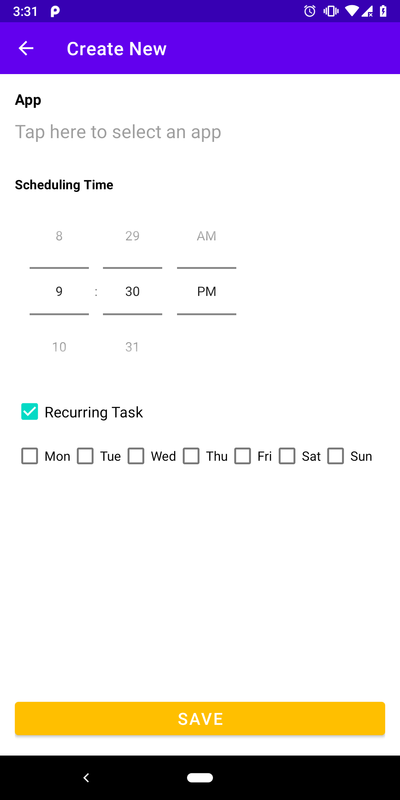
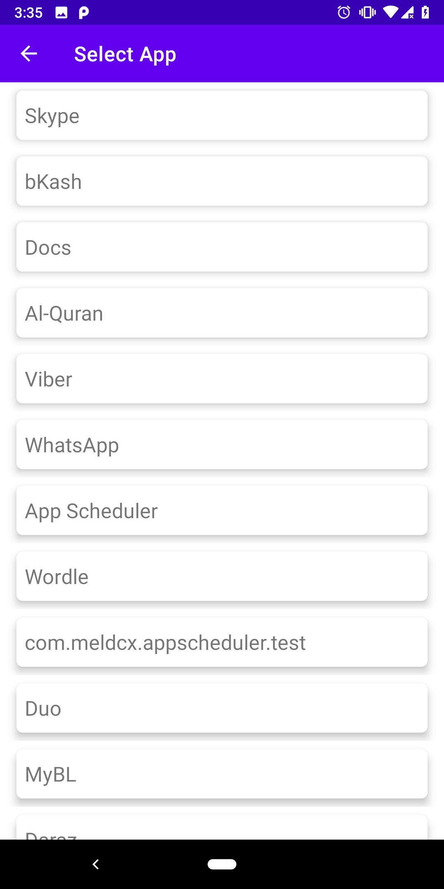

# App Scheduler

This project uses a set of Android Jetpack libraries, Uses Dagger2 library for dependency injection and JUnit for unit testing. The App uses Kotlin.

### Note
After installing the app you must give the "Display over other apps" permission

### Prerequisites

The project has all required dependencies in the gradle files. 
Add the Project to Android Studio or Intelij and build.All the required dependencies will be downloaded and installed.

## Architecture

The project uses MVVM and MVI architecture pattern.

## Libraries 

* [ViewModel](https://developer.android.com/topic/libraries/architecture/viewmodel/) - Manage UI related data in a lifecycle conscious way and act as a channel between use cases and ui
* [DataBinding](https://developer.android.com/topic/libraries/data-binding) -EazeGraph is an Android library for creating beautiful and fancy charts. Its main goal was to create a lighweight library which is easy to use and highly customizeable with an "up-to-date"-look.

* [Dagger 2](https://dagger.dev/dev-guide/) - For Dependency Injection.
* [Kotlin Flow](https://developer.android.com/kotlin/flow) - To access data sequentially

## Screenshots
||||
|:----:|:----:|:----:|

## Demo
||
|:----:|
=======
# AppScheduler
